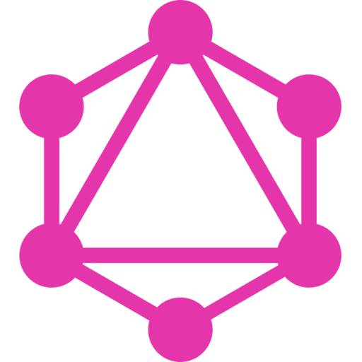

# Jimmy Paolini

<!--  -->

Friend, Explorer, Musician, Engineer, Latinist, Tea Enthusiast

### Creator of <a href="https://www.lexicolatin.com">Lexico </a>

### Education  

### Languages         

### Databases  

### Libraries            

### Infrastructure              

### Services     

### Tools          

### Learning Next       

### Learning Later     

