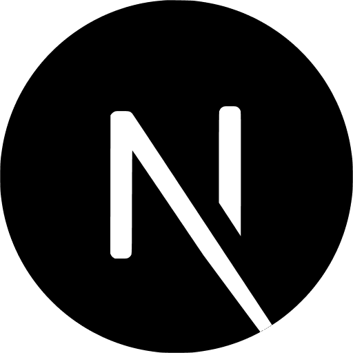
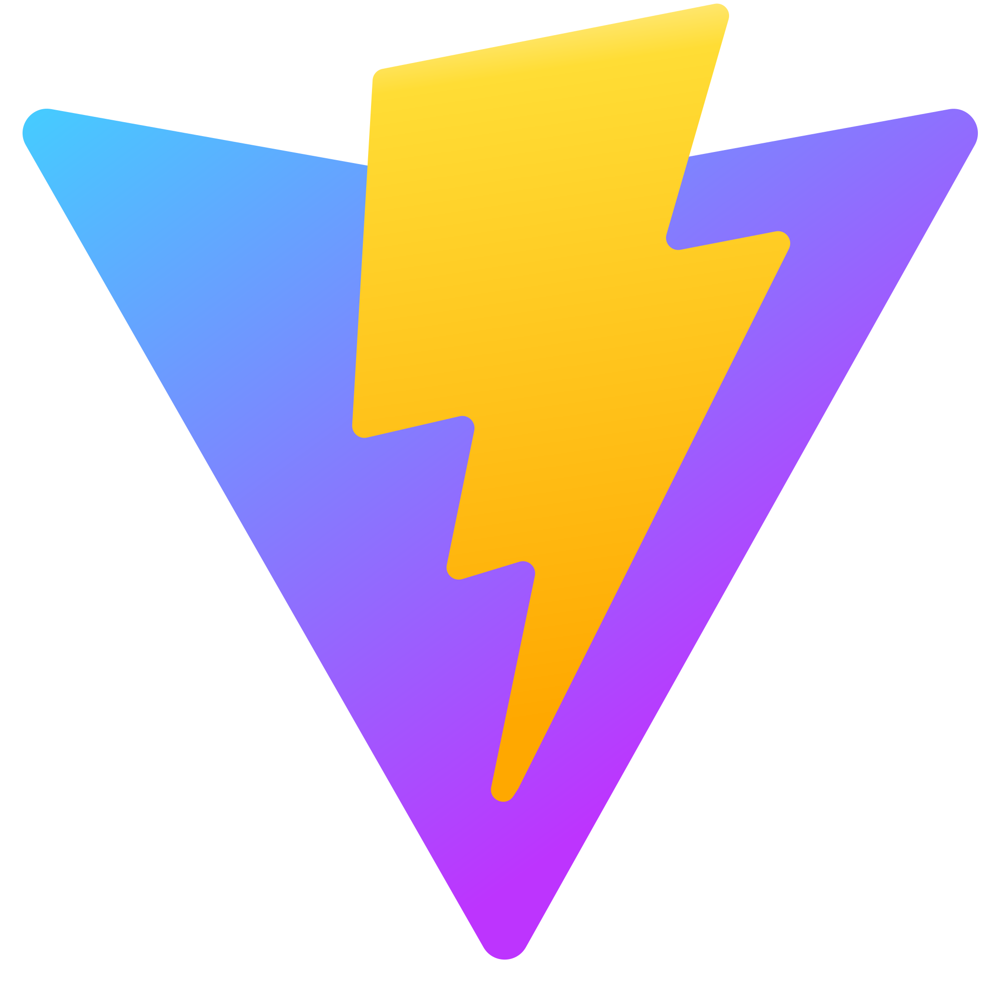
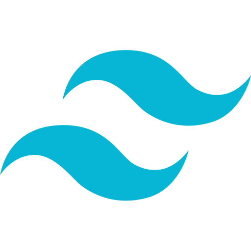
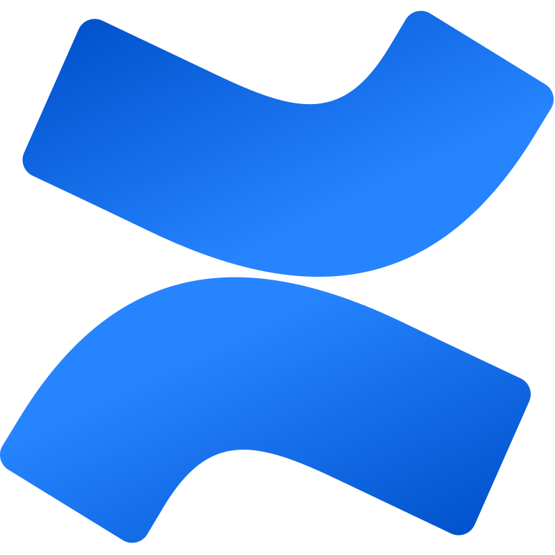
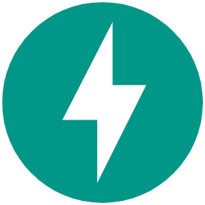
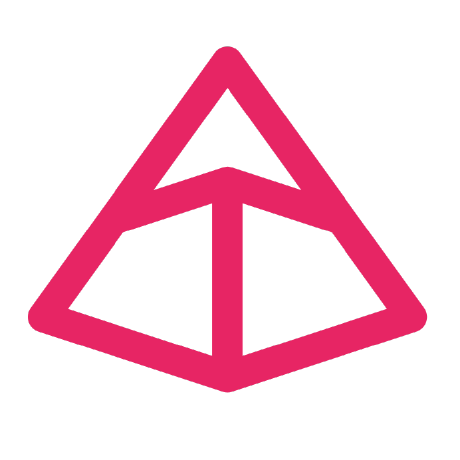

# Jimmy Paolini

## Projects, Experience, Education

## Technology I Know 📖

### Languages 🦜

>)

### Artificial Intelligence 🧠

### Frontend 🖼️

<a href="https://www.npmjs.com/package/recharts" style="font-size: 56px; text-decoration: none;" alt="recharts">📊</a>

### Styles 🎨

### Authentication & Authorization 🛂

### Application Programming Interface (API) 📡

### Backend 🧭

### Databases 🗄️

### Architecture 🏗️

### Observability 👁️

### Infrastructure ☁️

### Testing 🧪

<!-- Playwright -->

### Tools 🛠️

### Services 🤲

### Applications 🎪

## Technology I Want To Know 🌠

